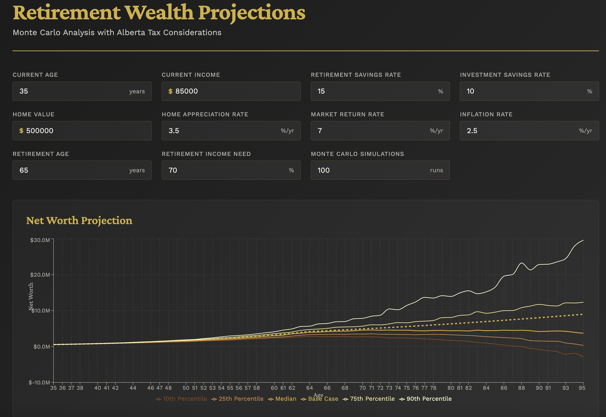

# Retirement Wealth Projections



An app to simulate uncertainty in retirement net worth forecasting.

## Features

- Interactive retirement projection calculator
- Monte Carlo simulation with configurable scenarios
- Provincial (Alberta) and federal (Canada) tax calculations
- Visualization of percentile outcomes
- Detailed year-by-year breakdown tables

## Running with Docker

### Build the Docker image:
```bash
docker build -t retirement-planner .
```

### Run the container:
```bash
docker run -p 3000:3000 -v $(pwd):/app -v /app/node_modules retirement-planner
```

Then open your browser to: http://localhost:3000

## Running without Docker

### Install dependencies:
```bash
npm install
```

### Start the development server:
```bash
npm run dev
```

Then open your browser to: http://localhost:3000

## Configuration

### Default Values

Copy the example environment file and customize with your own defaults:

```bash
cp .env.example .env
```

Edit `.env` to set your personal default values:

```
VITE_DEFAULT_CURRENT_AGE=35
VITE_DEFAULT_CURRENT_INCOME=85000
VITE_DEFAULT_SAVINGS_TO_RETIREMENT=15
VITE_DEFAULT_SAVINGS_TO_INVESTMENT=10
VITE_DEFAULT_HOME_VALUE=500000
VITE_DEFAULT_HOME_APPRECIATION_RATE=3.5
VITE_DEFAULT_MARKET_RETURN=7.0
VITE_DEFAULT_INFLATION_RATE=2.5
VITE_DEFAULT_RETIREMENT_AGE=65
VITE_DEFAULT_RETIREMENT_INCOME_PERCENT=70
VITE_DEFAULT_NUM_SIMULATIONS=100
```

The `.env` file is gitignored so your personal financial data won't be committed.

### Interactive Adjustments

You can also adjust values in the interface:
- Current age and income
- Savings rates (retirement and investment accounts)
- Home value and appreciation rate
- Expected market returns and inflation
- Retirement age and income needs
- Number of Monte Carlo simulations

## How It Works

1. **Base Case**: Deterministic projection using fixed rates
2. **Monte Carlo Simulations**: Run multiple scenarios with stochastic rates
3. **Tax Calculation**: Accurate Alberta provincial and federal tax brackets
4. **Visualization**: Shows percentile bands (10th, 25th, median, 75th, 90th)
